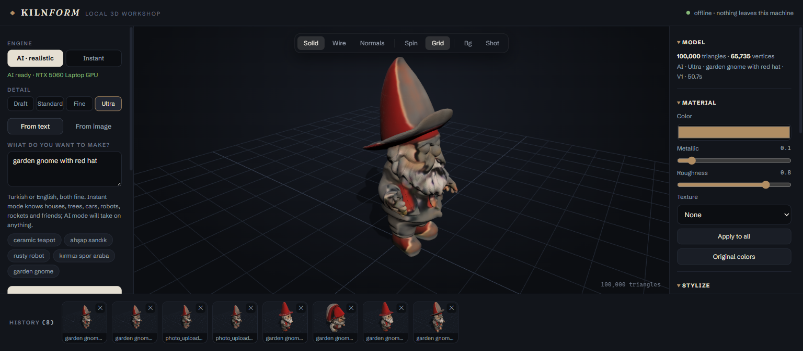

# ◆ Kilnform

A local 3D workshop. Type a prompt or hand over an image; a 3D model gets made
**on your own machine** — viewed, styled, and exported without a single byte
leaving localhost.


<p align="center"><i>"garden gnome with red hat" on the Ultra tier — Hunyuan3D-2mini sculpts 100,000 triangles, TripoSR bakes the 1024² texture, ~30 seconds warm on an RTX 5060 Laptop — entirely offline. The shelf below holds earlier makes.</i></p>

Two engines share one bench:

- **AI · realistic** — a fully local pipeline: your prompt is translated if needed
  (opus-mt, CPU), painted into a reference image (SD-Turbo, 8 steps for a cleaner,
  vividly-lit subject), cut out (rembg/isnet), sculpted into a real mesh (TripoSR)
  on your GPU, then smoothed and baked into a UV-textured GLB. The baked color is
  lifted out of TripoSR's naturally washed-out triplane range so textures read
  lifelike rather than muddy. A prompt like `çeşme` becomes an actual tiered
  fountain — crisp 1024² texture included — in well under half a minute. Four
  detail tiers:
  **Draft / Standard / Fine** trade marching-cubes resolution for speed (5–16s),
  and **Ultra** hands the sculpting to a dedicated shape-generation model,
  Hunyuan3D-2mini (0.6B flow-matching DiT) at a 448 octree resolution, for
  visibly sharper geometry — 100k triangles in ~35s warm. TripoSR still paints
  it: its triplane color field is baked onto the Hunyuan mesh, so Ultra keeps
  the same textured-GLB output. Image uploads take PNG/JPG/WEBP and iPhone
  HEIC photos; the subject is cut out of the background automatically and the
  cutout is shown next to the result.
- **Instant** — a deterministic procedural generator. It parses Turkish/English
  keywords (house, tree, car, robot, rocket… plus color/size/material adjectives)
  and builds parametric models with seeded variations. No GPU, no wait, works on
  any machine.

Everything downstream is engine-agnostic: orbit viewer with studio lighting,
material editing, stylization (voxelize / low-poly / toon), transforms, an
IndexedDB library shelf, and GLB / OBJ / STL export (STL is 3D-print ready).

Prompts can be Turkish or English — the UI is English, the understanding is both.

## Privacy, as a design rule

- Both servers bind to `127.0.0.1` only.
- Model weights are downloaded once at setup; after that the whole thing runs offline.
- Images, prompts, and generated meshes never touch the network. The top bar has a
  live sentinel that flags any request leaving localhost — it should never trigger.

## System requirements

| | Instant engine | AI engine |
|---|---|---|
| OS | any modern browser | Windows 10/11 (tested); Linux should work with minor script changes |
| Node.js | 18+ | 18+ |
| Python | — | 3.12 (installed automatically via `uv`) |
| GPU | not needed | NVIDIA, ~6.5GB free VRAM (8GB card recommended); Blackwell (RTX 50xx) needs the CUDA 12.8 wheels the setup installs. CPU fallback works but is slow (~1–2 min/model) |
| RAM | any | 16GB+ for Draft–Fine; 24GB recommended for Ultra (idle models park in system RAM) |
| Disk | ~200MB | ~12GB (PyTorch + model weights); +8GB if you use the Ultra tier (Hunyuan3D-2mini weights, downloaded on first Ultra make) |

Measured on an RTX 5060 Laptop (8GB): a Draft/Standard/Fine make is a 5–16s
burst depending on the detail tier (Fine bakes the 1024² texture), ~45W / 64°C
peak, ~6.5GB VRAM peak, idle between requests. An Ultra make is ~35s warm
(~65-70s for the first request after the backend starts, while models load
into RAM; longer still on the very first Ultra make ever, which also
downloads 8GB of weights): diffusion sampling is ~11s of that, the rest is
the 448-resolution surface decode, texture baking, and model shuffling —
SD-Turbo, TripoSR, and Hunyuan all take turns on the GPU so the whole thing
stays inside 8GB instead of spilling into shared GPU memory. A 512 octree
resolution was tried and rejected: it looks sharper but its *system RAM*
footprint (not VRAM) pushed the backend process past 23GB and into pagefile
swap, tripling make times on a 24GB machine. Laptop-friendly. One Windows gotcha handled in code: a minimized
backend console can be put in EcoQoS ("efficiency mode"), which made generation
4x slower — the backend opts itself out at startup.

## Setup

```bat
npm install            # web UI dependencies
backend\setup.bat      # one-time: Python env, PyTorch cu128, TripoSR, model weights (~5GB download)
```

Skipping `backend\setup.bat` is fine — the app runs in Instant mode without it.

## Run

```bat
start.bat              # starts backend + web UI, opens http://127.0.0.1:5173
```

## How the AI pipeline stays Windows-friendly

TripoSR normally requires `torchmcubes`, which needs a C++/CUDA build. Kilnform
ships a small shim ([backend/torchmcubes.py](backend/torchmcubes.py)) that
provides the same interface via `skimage.measure.marching_cubes`, so nothing has
to compile. Mesh winding is normalized and the result is rotated z-up → y-up
before export. Texture baking ([backend/texbake.py](backend/texbake.py)) is
adapted from TripoSR's bake code with two fixes: one reused GL context instead
of a fresh (leaked) one per make, and triplane color queries on the GPU.

The Ultra tier uses only the shape half of Hunyuan3D-2 (`hy3dgen.shapegen`),
which also needs no compiled extensions — the parts that do (its texture
painter) are exactly the parts Kilnform replaces with its own bake. Hunyuan's
mesh comes out in a different coordinate frame than TripoSR's; a fixed axis
permutation plus a per-make bounding-box fit (against a quick low-res TripoSR
mesh of the same image) lines the two up so the color bake lands correctly
([backend/hunyuan.py](backend/hunyuan.py)).

## Licenses of the parts

Kilnform's own code is **MIT-licensed** — see [LICENSE](LICENSE). That covers this
repository's own source only; the third-party pieces it stands on keep their own
licenses (weights are downloaded by each user at setup, never redistributed here):

- [three.js](https://threejs.org) — MIT
- [TripoSR](https://github.com/VAST-AI-Research/TripoSR) (code & weights) — MIT
- [SD-Turbo](https://huggingface.co/stabilityai/sd-turbo) weights — **Stability AI
  non-commercial research license**. Weights are downloaded by each user at setup,
  not redistributed here. If you need commercial use, swap the model id in
  `backend/pipeline.py` for a permissively licensed one.
- [Hunyuan3D-2](https://github.com/Tencent-Hunyuan/Hunyuan3D-2) (Ultra tier, code
  & weights) — **Tencent Hunyuan 3D 2.0 Community License**. Commercial use is
  allowed up to 100M monthly active users, but **use is not licensed in the EU,
  the UK, or South Korea** — if you are there, stick to the Draft/Standard/Fine
  tiers, which don't touch Hunyuan. Weights are downloaded by each user on the
  first Ultra make, never redistributed here.
- Helsinki-NLP opus-mt-tr-en — CC-BY 4.0 · rembg/u2net — Apache-2.0
- UI fonts [Fraunces](https://github.com/undercasetype/Fraunces) and
  [Schibsted Grotesk](https://github.com/schibsted/schibsted-grotesk) — SIL OFL 1.1,
  served locally from `public/fonts` (no runtime font CDN requests)
